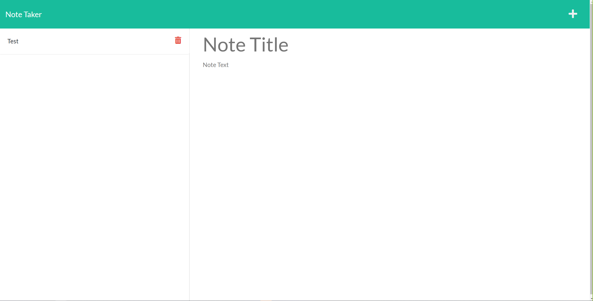

# modified-note-taker

# Project Title
Modified Note Taker

# Description
using node and express to fix a note taker

# Table of Contents 
* [Installation](#-Installation)
* [Usage](#-Usage)
* [License](#-Installation)
* [Contributing](#-Contributing)
* [Tests](#-Tests)
* [Questions](#-Contact-Information)
    
# Installation
first `npm install` then run `node server.js`

# Usage
We can use this to take and delete notes easily from the website

# License 
MIT
* As this license list was not comprehensive, if you need another license, use the contact information below to ask for license to be added. 

# Contributing 
Following me on github and accessing the public repo

# Tests
check all syntax and spelling before use to avoid errors. As well as making sure the node version is current along with a working db.json

# Contact Information 
* GitHub Username: danielmiller18
* Contact Email: daniel.miller18@yahoo.com

